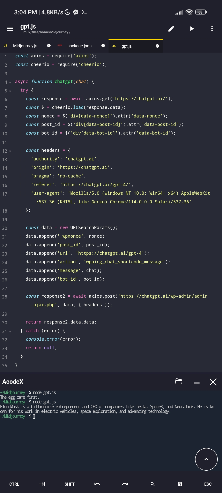

# ChatGPT-3-Unlimited-API

This JavaScript code interacts with the ChatGPT AI chatbot on the ChatGPT website. It sends a message to the chatbot and receives the response. The code uses Axios for making HTTP requests and Cheerio for web scraping.



API Crawled from chatgpt.ai
Enjoy unlimited queries with no limits! 

## How To Use

1. Install the required libraries by running `npm install axios cheerio`.
2. Import the necessary libraries in your JavaScript code.
3. Call the `chatgpt` function with your chat input as a parameter.
4. The function returns the response from the ChatGPT API.

Example Usage:

```javascript
const axios = require('axios');
const cheerio = require('cheerio');

async function chatgpt(chat) {
  try {
    // ... (rest)
  } catch (error) {
    console.error(error);
    return null;
  }
}

(async () => {
  const result = await chatgpt("who is elon musk");
  console.log(result);
})();
